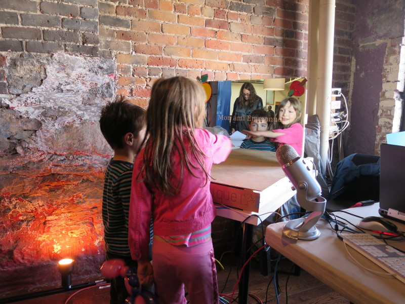
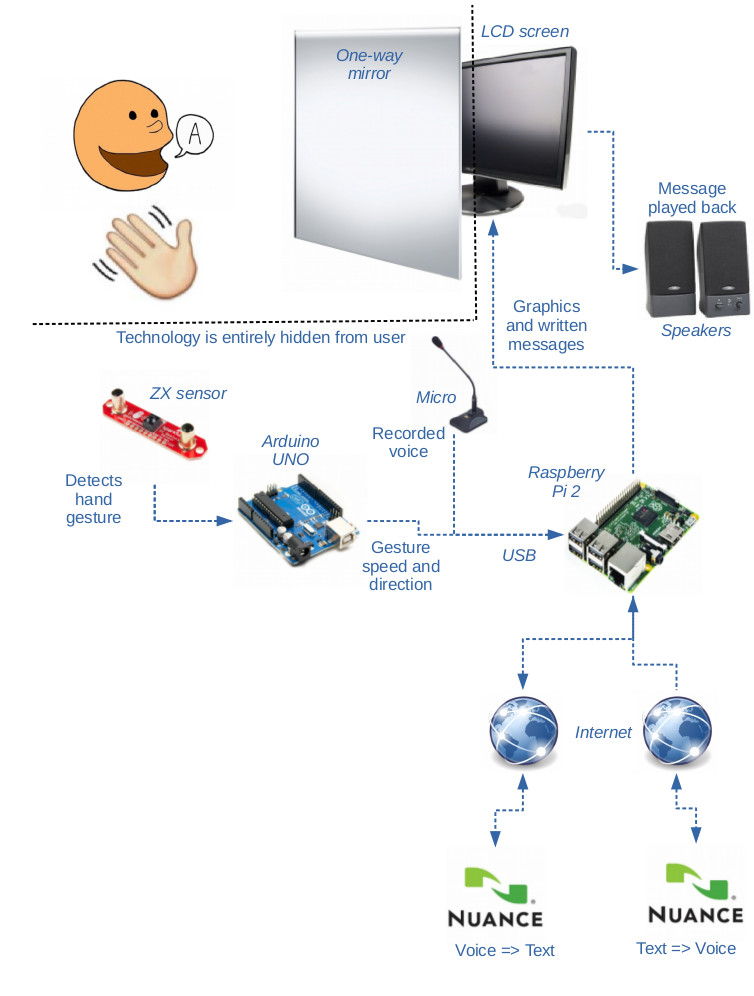

#
Le Miroir Magique

## L'idée

  Mon enfant de 5 ans, qui ne sait ni lire ni écrire, me demande quotidiennement d'écrire des mots afin de les retranscrire. Puisque je ne suis pas toujours disponible, je lui propose de remplacer le miroir de sa commode par un «Miroir Magique» qui pourrait lui montrer comment s'écrivent les mots.

  Ça semble une bonne idée!

## Les buts

  - Assister l’enfant dans son apprentissage de la lecture et de l’écriture.
  - Motiver l’enfant à lire, écrire et développer sa diction.

## Comment ça marche

  

  1. Le Miroir Magique est placé dans la chambre de l’enfant.
  2. Un passage de la main en face du miroir active l’écoute.
  3. Une tête qui tend l’oreille apparaît dans le miroir pour indiquer qu’il écoute.
  4. L’enfant dit une phrase au miroir en parlant dans le micro.
  5. Une animation indique à l’enfant que le miroir réfléchit pour identifier comment ça écrit.
  6. Le miroir affiche le texte correspondant à ce que l’enfant à dit.
  7. Puis le miroir lit la phrase affichée.
  8. Après un certain délai, le texte disparaît.
  9. Le miroir est revenu à son état initial.

## Démonstration

  

## Le matériel

  - Un miroir sans tain, ou en anglais un  «one way mirror» (Mirropane™)
  - L'écran:
    - Un moniteur d'ordinateur avec une prise HDMI
    - Câble HDMI
  - Le Raspberry PI:
    - Raspberry PI 2 – Model B
    - Carte uSD UHS-I, d'au moins 8 Go
    - Bloc d'alimentation micro USB 5V 2000 ma
  - Microphone USB
  - Haut-Parleurs
  - L'Arduino
    - Arduino UNO
    - Câble USB
  - Senseur: 
    - [ZX Distance and Gesture Sensor](https://www.sparkfun.com/products/12780)
  - Clef USB WiFi (alternativement une connexion filaire RJ-45)
  - Concentrateur USB
  - Clavier USB
  - Souris USB

  

## Le Raspberry PI.

  *En bref:*

    1. Installation de Raspbian Jessie
    2. Démarrage du PI
    3. Configuration Internet
    4. Configuration initiale
    5. Mises à jour
  
  1. Installation de Raspbian Jessie version 2015-09-24 sur la carte uSD.
  
     On peut suivre les instructions sur le site de [Raspbian](https://www.raspberrypi.org/downloads/raspbian/)

     Dans notre cas, nous avons effectué la procédure suivante:

     1. Téléchargement de l'[image Raspbian Jessie de 2015-09-24](https://downloads.raspberrypi.org/raspbian/images/raspbian-2015-09-28/).

            wget https://downloads.raspberrypi.org/raspbian/images/raspbian-2015-09-28/2015-09-24-raspbian-jessie.zip

        **NOTE:** Approx. 1.2G.

     2. Décompression de l'archive

            unzip -d 2015-09-24-raspbian-jessie.zip

        **NOTE:** (Approx. 4.1G)

     3. Insertion de la carte uSD à l'aide d'un adapteur uSD à SD dans le lecteur de notre ordinateur Linux.

            ls /dev/mmcblk0
            umount /dev/mmcblk0p*

        **NOTE:** Le umount est requis seulement en cas de montage automatique.

     4. Écriture de l'image sur la carte uSD.

            dd if="2015-09-24-raspbian-jessie.img" bs="32M" of="/dev/mmcblk0"

        **NOTE:** Durée approximative 10 minutes (une carte lente 15 minutes, une carte rapide 7 minutes)

  2. Démarrage du PI

    - Insérer la carte uSD dans le PI
    - Brancher l'écran au PI à l'aide du cable HDMI
    - Branher les périphériques USB
      - Brancher la clef WiFi (ou mieux un lien filaire RJ-45)
      - Brancher le microphone
      - Brancher le Arduino UNO
      - Brancher le concentrateur
        - Brancher le clavier
        - Brancher la souris
    - Brancher l'alimentation du PI avec le cable micro USB

  3. Configuration Internet

     Si vous optez pour une connexion filaire RJ-45, il n'y a rien à faire.
     Sinon, pour un lien WiFi, on a utilisé la démarche suivante:

     1. Cliquer sur l'icone réseau en haut à droite (2 écrans superposés)
     2. Cliquer sur votre point access (votre SSID)
     3. Entre le mot de passe de votre WiFi

  4. Configuration initiale

     Dans un premier temps, il est extrêmement important de modifier le mot de passe du système puisqu'on est branché à Internet.

     Dans un deuxième temps, maximiser l'utilisation de la carte uSD et personnaliser les options selon vos préférences.

     Voici comment nous avons personnalisé nos paramètres:

     - Cliquer [Menu] en haut à gauche pour ouvrir le menu principal
     - Cliquer [Preferences] pour ouvrir le sous-menu
     - Cliquer [Raspberry Pi Configuration]
       - Dans l'onglet [System]
         - Cliquer [Expand Filesystem] pour utiliser tout l'espace sur la uSD
         - Cliquer [Change Password...]
           - Entrer le nouveau mot de passe
         - Hostname: miroir (un nom personnalisé)
         - Overscan: Disabled
       - Cliquer sur l'onglet [Localisation]
         - Cliquer [Set Locale...]
           - Language: en (English)
           - Country: US (USA)
           - Character Set: UTF-8
       - Cliquer [Set Timezone...]
         - Area: Canada
         - Location: Eastern
       - Cliquer [Set Keyboard...]
         - Country: United States
         - Variant: English (US)

     **NOTE:** Pour une raison inconnue, il n'est pas possible de faire tous les changements en une seule étape. Par exemple, après le «reboot», l'ancien nom de domaine est encore utilisé. De plus, le clavier revient toujours à UK.

  5. Application des Mises à jour

     Mettre à jour la liste des paquets, puis faire une mise à jour globale.

    Afin de s'éviter des téléchargements inutiles, on retire au préalable `libreoffice` du system.

    Pour cette étape, favoriser un lien filaire (RJ-45) à la place d'un lien WiFi afin d'accélérer les téléchargements.

        > sudo apt-get update
        > sudo apt-get remove libreoffice*
        > sudo apt-get autoremove
        > sudo apt-get upgrade

## Le code source (GitHub)

  *En bref:*

    1. Installation des paquets requis
    2. Téléchargement des sources du projet
    3. Installation des dépendance JavaScript pour le back-end
    4. Installation des dépendance JavaScript pour le font-end

  Ouvrir une fenêtre de terminal, puis effectuer les commandes suivantes.

      > sudo apt-get install sox iceweasel npm nodejs-legacy xdotool alsa-utils # Étape 1.
      > git clone https://github.com/sebascabot/magic-mirror.git                # Étape 2.
      > cd magic-mirror
      > npm install                                                             # Étape 3.
      > cd source/front-end
      > ../../node_modules/.bin/bower install                                   # Étape 4.

  **NOTE:** Les erreurs de compilation de `socket.io` n'affectent pas le fonctionnement du produit.

## Les haut-parleurs

  *En bref:*

    0. Branchement
    1. Sélection du périphérique audio
    2. Ajustement du volume de sortie (test audio)

  0. Branchement

     Brancher les haut-parleurs dans la prise audio du moniteur, ainsi le son est transmit numériquement via le connecteur HDMI.

     NOTE: On n'utilise pas la prise audio sur le PI pour obtenir une meilleur qualité audio.

  1. Sélection du périphérique audio

     Clique gauche sur l'icone Haut-Parleur en haut à droite.

     - S'assurer que c'est HDMI qui est sélectionné (crochet vert).

  2. Ajustement du volume de sortie (test audio)

     Clique droit sur l'icone Haut-Parleur en haut à droite.
     - S'assurer que «Mute» n'est pas coché
     - Ajuster le volume selon vos préférences

     Pour genérer un son utiliser la commande `speaker-test` dans une fenêtre de terminal (faire CTRL-C pour l'arrêter).

## Le Microphone

  *En bref:*

    1. Ajustement du volume de capture
    2. Identificationd de la chaîne de description `hw` 
    3. Test d'enregistrement
    4. Configuration

  1. Ajustement du volume de capture

     Il faut ouvir le «mixer» pour notre périphérique de capture

     - Cliquer successivement  [Menu] > [Preferences] > [Audio Device Settings]
     - Sélectionner «Sound card:» qui correspond à votre microphone.
     - Cliquer le bouton [Select Controls...] en bas à gauche.
     - La boîte de dialogue «Slect Controls» s'ouvre.
     - Cocher toutes les cases à cocher dans la boîte de dialogue.
     - Cliquer le bouton [Close] en bas à droite.

     Les contrôles sous l'onglet «Capture» permettent d'ajuster le niveau sonore de l'enregistrement. S'assure que «Mute» n'est pas actif, c'est-à-dire que le point sous le contrôle de volume est rouge et non pas grisé.

  2. Identificationd de la chaîne de description `hw` 

     Ouvrir un fenêtre de terminal pour effectuer les opérations suivante.

     Utiliser la commande `arecord -l` pour identifier la valeur de votre
     paramètre `card`.

     Ex. Dans notre cas ici, on trouve `card = 1`

        > arecord -l
        **** List of CAPTURE Hardware Devices ****
        card 1: Microphone [Yeti Stereo Microphone], device 0: USB Audio [USB Audio]
          Subdevices: 1/1
          Subdevice #0: subdevice #0

     Avec ce paramètre on construit la chaîne qui identifie notre «device» de capture avec la syntaxe "hw:<card>", ce qui nous a donné `"hw:1"`.

     Pour vérifier la validité de `"hw:1"` on l'utilise pour l'option `--device` avec `arecord`, ce qui produit un résultat similaire à:

         > arecord --device="hw:1" --dump-hw-params
         Recording WAVE 'stdin' : Unsigned 8 bit, Rate 8000 Hz, Mono
         HW Params of device "hw:1,0":
         --------------------
         ACCESS:  MMAP_INTERLEAVED RW_INTERLEAVED
         FORMAT:  S16_LE
         SUBFORMAT:  STD
         SAMPLE_BITS: 16
         FRAME_BITS: 32
         CHANNELS: 2
         RATE: [8000 48000]
         PERIOD_TIME: [1000 16384000]
         PERIOD_SIZE: [16 131072]
         PERIOD_BYTES: [64 524288]
         PERIODS: [2 1024]
         BUFFER_TIME: (666 32768000]
         BUFFER_SIZE: [32 262144]
         BUFFER_BYTES: [128 1048576]
         TICK_TIME: ALL
         --------------------
         arecord: set_params:1233: Sample format non available
         Available formats:
         - S16_LE

  3. Test d'enregistrement

     La commande qui suit va amorcer l'enregistrement au moment d'une augmentation du seuil audio de 5% ou plus. Ensuite, l'enregistrement se terminera automatiquement à la détection d'une période de 2 secondes avec un seuil de 5% ou moins.

         > AUDIODEV="hw:1" rec test.wav silence -l 1 0:00 5% 0 0:02 5%

         Input File     : 'hw:1' (alsa)
         Channels       : 2
         Sample Rate    : 48000
         Precision      : 16-bit
         Sample Encoding: 16-bit Signed Integer PCM

         In:0.00% 00:00:04.61 [00:00:00.00] Out:122k  [      |      ]        Clip:0
         Done.

         > play test.wav

         test.wav:

         File Size: 488k      Bit Rate: 1.54M
           Encoding: Signed PCM
           Channels: 2 @ 16-bit
         Samplerate: 48000Hz
         Replaygain: off
           Duration: 00:00:02.54

         In:100%  00:00:02.54 [00:00:00.00] Out:122k  [      |      ]        Clip:0
         Done.

  4. Configuration

     À la racine du dossier du `magic-mirror`, dans le fichier de configuration, saisir la chaîne «device» que vous avez identifiée.

         > vi configuration.json
         ...
         device: {
           "record": "hw:1",
           "playback": ""
         }
         ...

## L'accès à Nuance.

  *En bref:*

    1. Creation du compte Nuance
    2. Récupération des ID
    3. Configuration

  1. Creation du compte Nuance

     Aller sur [developer.nuance.com](https://developer.nuance.com) pour créer votre compte.

     - Cliquer sur le bouton [Sign Up] en haut à droite.
     - Remplir et soumettre le formulaire.

  2. Récupération des ID

     - Après la confirmation par email, se connecter avec son nouveau compte.
     - Dans la section  «My Sandbox» à gauche, cliquer sur le lien «Sandbox Credentials».

     - Indenfier votre «AppKey» pour client HTTP. Il s'agit d'une chaîne de 128 chiffres hexadecimaux.

        Ex.
            HTTP Client Applications

              For developing an HTTP Client application, pass in the AppID displayed above, and your AppKey formatted as a 128-Byte String:
              969cd2d4a33f4563f3f6125a0f1f06446888fb1ec54908ef90e70e359fd0b1376c830a7fc24f7ac2458c1c55ab229914269432ebdd3bdb6d2ae9a2c9b953ff22

     - Indenfier votre «AppId», il s'agit d'une chaine de la forme NMDPTRIAL_<email>_<domain>_<tld>yyyymmddhhmmss"

        Ex.
          NMDPTRIAL_perenoel_polenord_com20151224235959"

        **NOTE:** 500 transactions par jours sont permises et cela pour une durée de 90 jours. Après le délais de 90 jours, il sera nécessaire de cliquer sur `[Extend Sandbox Access]`

  3. Configuration

     À la racine du dossier du `magic-mirror`, dans le fichier de configuration, actualiser `applicationKey` avec votre `AppKey` et de même pour le `applicationId` avec votre `AppId`.

         > vi configuration.json
         ...
             "Nuance": {
                "applicationKey" : "123456789abcdef...",
                "applicationId" : "NMDPTRIAL_bob_facebook_com20151225000000"
             },
         ...

## Arduino (Microcontrolleur)

  *En bref:*

    1. Installation de l'IDE Arduino
    2. Branchement du senseur ZX Gesture
    3. Programmation Arduino
    4. Verification du fonctionnement
    5. Configuration

  1. Installation de l'IDE arduino

         > sudo apt-get install arduino

  2. Branchement du senseur ZX Gesture

     Nous avons utilisé le bus I2C avec une alimentation 5V.

             Arduino           Senseur ZX
          --------------       -----------
            (POWER)  GND  <=>  GND  (UART)
            (POWER)   5V  <=>  VCC  (UART)
          (DIGITAL)    2  <=>  DR   (I2C)
           (ANALOG)   A4  <=>  DA   (I2C)
           (ANALOG)   A5  <=>  CL   (I2C)

    Ref: [Diagramme Fritzing avec un «board» équivalent au Arduino UNO](https://cdn.sparkfun.com/assets/learn_tutorials/3/4/5/zx_sensor_fritzing_bb.png)

  3. Programmation Arduino

      - Ouvrir l'IDE Arduino
        - [Menu] > [Programming] > [Arduino IDE]
      - Selection du port série
        - [Tools] > [Serial Port] > [/dev/ttyACM0]
      - Ouverture du «sketch»
        - [File] > [Open]
        - Choisir le fichier
          `~/magic-mirror/source/sensors/zxGestureSensor/zxGestureSensor.ino`
      - Compilation et installation
        - Cliquer l'icone avec la flèche vers la droite (2e icone à gauche)
      - Overture de la console
        - Cliquer l'icon avec la loupe (icone complètement à droite)

  4. Vérification du fonctionnement

     Le senseur doit pointer vers le haut et être libre de tout obstacle. Passer la main de gauche à droit (ou droite à gauche) à une hauteur approximative de 20 cm au dessus du senseur. La description des «swipes» devrait s'afficher dans la console.

     Ex. 

         {"swipe": "missed"}
         {"swipe": "right", "speed": 3}
         {"swipe": "left", "speed": 12}

  5. Configuration

     Éditer le fichier `configuration.json` pour spécifier le «device» et la vitesse associée au port série du Arduino.

     Ex.

         > vi configuration.json
         ...
           "sensorSerial": {
             "device": "/dev/ttyACM0",
             "speed": 9600
           }
         ...

## Le démarrage de l'application

  Au moment de la première utilisation, il faut modifier un peu les préférences de Iceweasel.

  - Ouvrir Iceweasel
    [Menu] > [Internet] > [Iceweasel]
  - Ouvrir la boîte de dialogue des préférence
    - Cliquer sur l'icone de style Hambergur complètement à droite
    - Cliquer sur [Preferences]
  - Rester dans l'onglet «General»
  - Conserver le choix:
        When Iceweasel starts: [  Show my home page  ]
  - Entrer l'adress de notre serveur local pour la page d'acceuil
        Home Page: [  http://localhost:8080/  ]
  - En bas, à droite, cliquer sur le bouton `[Close]`
  - Maximiser Iceweasel
    - Appuyer sur la touche `[F11]`
  - Quitter Iceweasel
    - Positionner le curseur de la souris dans le coin supérieur droit de l'écran
    - On observer l'apparition de l'icon de fermeture `[X]`
    - Cliquer sur le `[X]`
  - Ouvrir Iceweasel de nouveau
    [Menu] > [Internet] > [Iceweasel]

  Normalement, a cette étape, on devrait avoir une fenêtre maximisée de Iceweasel avec le message suivant:

      «Iceweasel can not establish a connexion with the server localhost:8080»

  - Lancer le serveur

   À partir d'une fenêtre de terminal, idéalement via une connexion `ssh` au PI, aller à la racine du projet, dans `magic-mirror` et lancer l'application à l'aide du script `go.sh`.

   Le miroir magique est prêt à l'utilisation. 

## Bricolage

   - Construction d'une structure pour maintenir l'écran contre le miroir sans tein.
   - On place la surface réfléchissante du côté opposé de l'écran (face au sujet)
   - À l'arrière du miroir, il faut masquer les parties non disimulées par l'écran. Nous avons utilisé du carton retenu avec du ruban adhésif.
   - On fixe le senseur au bas du miroir

## Les variantes

#### APDS-9960

  Détection des mouvements avec le senseur [«SparkFun RGB and Gesture Sensor - APDS-9960»](https://www.sparkfun.com/products/12787).

  Cette approche à l'avantage de réduire les coûts et de simplifier le montage puisque le Arduino n'est plus nécessaire et que ce senseur se vend à un prix moindre. D'un autre côté, il a l'inconvénient de taxer le système par une utilisation abusive du CPU. Cela ne devrait pas se produire, c'est quelque chose que nous devons corriger.

  On peux se procurer ce senseur chez [ABRA electronic](https://abra-electronics.com/sensors/sensors-proximity-en/sen-12787-sparkfun-rgb-and-gesture-sensor-apds-9960.html)
  pour 20$.

#### Sortie audio USB.

  Pour un son plus puissant, nous avons branché un vieux système audio USB de Microsoft. Le résultat est une excellent qualité sonore et une expérience plus immersive.

#### Utilisation d'un téléviseur

  On peut facilement remplacer le moniteur par un téléviseur pour couvrir une plus grande surface. Nous avons fait le test, malheureusement pour nous il a été impossible de diminuer la luminosité du «backlight» suffisament pour éviter de voir le contour de l'écran à travers le miroir. Le problème est plus apparent lorsqu'on est placé dans un angle de 45 degrés ou moins avec le miroir.

## Les problèmes connus

#### Fiabilité des connexions USB

  Afin de tenter d'améliorer la stabilité du lien USB du microphone, nous avons utilisé un cable USB plus court et un concentrateur alimenté de 2500 mA.  Malgré ces précotions, il arrive parfois que l'entré/sortie du micro se bloque. Il faut alors débrancher et rebrancher le micro, mais avec l'interupteur sur le concentrateur cette manipulation est beaucoup moins pénible.

  À la console de notre serveur on observe la trace suivant lorsque le micro USB se bloque.

      SoundRecorder> Recording...
      SoundRecorder> Command: rec -t s16 -r 16000 -c 1 recording.pcm silence -l 1 0:00 5% 0 0:02 5%
      SndRec :: stdout =>
      SndRec :: stderr => rec FAIL formats: can't open input  `hw:1': snd_pcm_hw_params error: Input/output error
      SndRec :: error => Error: Command failed: rec FAIL formats: can't open input  `hw:1,0': snd_pcm_hw_params error: Input/output error

#### Efficacité de la carte uSD.

  Après seulement quelques jours d'utilisation, notre première carte uSD qui était un modèle bon marché de Class 4 a flanché. En effet, la corruption sur la carte empêchait le système de redémarrer.

  Pour palier au problème, on s'est procuré une carte uSD de qualité. La «SanDisk Ultra Plus microSDHC UHS-I». Maintenant on remarque que tout le système réagit plus rapidement. La vitesse de notre ancienne carte était un goulot d'étranglement important pour les performances.

#### Dépôt Raspbian non disponible.

  Après l'installation de Jessie, le dépôt officiel de Raspbian n'était pas accessible.

  Pour contourner le problème, nous avons utilisé un dépôt miroir situé à proximité.

#### Séquence brisé au démarrage.

  Au démarrage, on ne voit pas le bonhomme qui écoute au premier enregistrement.

#### Le miroir fait des fautes d'orthographe

  Parmi les choix de textes retournés, il est fréquent qu'on tombe sur un texte avec des fautes d'orthographe évidentes. L'utilisation d'un correcteur orthographique pourrait nous aider à ne pas présenter aux enfants des fautes d'orthographe.

#### Troncature excessive

 Il est difficile de capturer le premier mot à cause de la troncature trop aggressive au début de l'échantillon envoyé à l'API HTTP de Nuance.

## Quelques adresses pour les achats

  Sur [BuyaPi.ca](buyapi.ca) (achat en ligne)
    - [Raspberry Pi 2 - Model B](http://www.buyapi.ca/product/raspberry-pi-2-model-b-armv7-with-1g-ram/) @ _44$_
    - [Kit Raspberry Pi 2 - Model B](http://www.buyapi.ca/product/raspberry-pi-2-b-starter-kit/) @ _76$_
    REMARQUE: Aucuns frais de livraison pour une commande de 200$ ou plus.

  ABRA Electronics (boutique à Montréal)
    - [ZX Distance and Gesture Sensor](https://abra-electronics.com/sensors/sensors-proximity-en/sen-12780-zx-distance-and-gesture-sensor.html?currency=CAN) @ _33$_
    - [Arduino UNO](https://abra-electronics.com/robotics-embedded-electronics/arduino-boards/ard-uno-arduino-uno-compatible-atmega16u2-board.html?currency=CAN) @ _20$_

  Vitrier
    - [Mirropane™](http://www.pilkington.com/north-america/usa/english/products/bp/bybenefit/specialapplications/mirropane/literature.htm) @ approx 25$ le pied carré

  Dollarama
    - Câble HDMI @ _2$_
    - Câble USB à micro-USB @ _1$_

