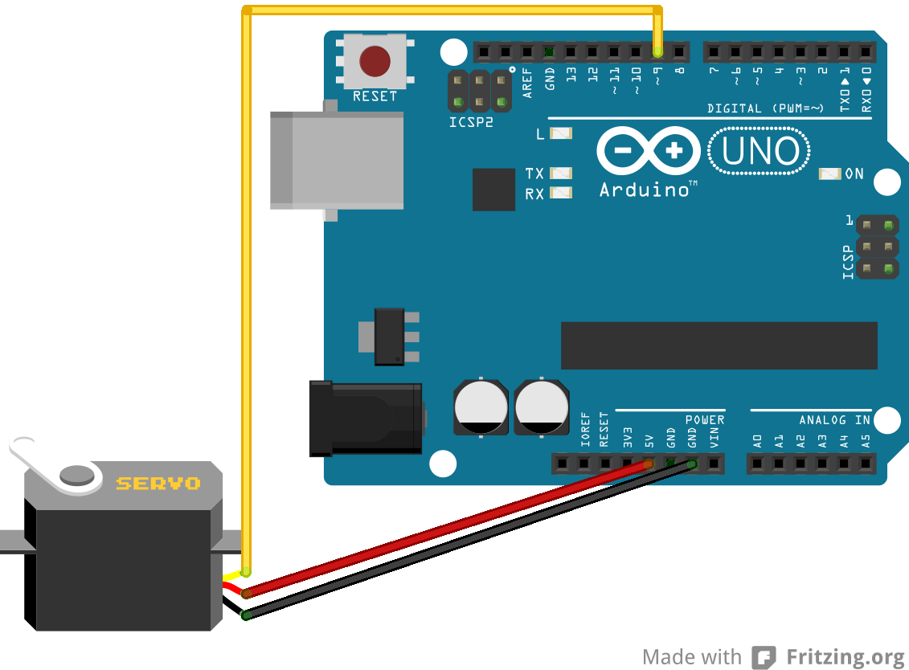

# Myo Marble Balance

Myo Marble Balance is a game of skill which goes from the physical world
to the digital world and back again. The goal is to balance a marble in a 
tilting channel by moving your arm.

## How it works
The game uses a [Myo sensor](https://myo.com) which tracks the player's 
hand position and gestures. A small piece of Javascript code running on the 
connected computer outputs position data to an Arduino which controls a servo 
motor that tilts a 3D printed plastic channel in response to the player's
movement.

The software on the control computer uses the Myo API to determine the angle
of the player's arm in space. It uses a simple serial protocol to send that
angle to the Arduino over a USB cable, and the Arduino adjusts the servo 
motor to that angle.

## Demo

Click to watch a short video demo:

## Components

#### Hardware

* [Myo gesture control armband](https://myo.com)
* Arduino Uno or similar
* Mini servo motor (we used the one bundled with the [SainSmart Ultimate 
Arduino Starter Kit](http://www.sainsmart.com/starter-kits/uno-r3-smartkits/sainsmart-starter-kit-rfid-master-with-motor-relay-lcd-servo-avr-for-arduino-1602-uno-r3.html),
but you could substitute any small servomotor)
* 3D printed marble channel
* Stand (we used a [PanaVise Jr](https://www.panavise.com/index.html?pageID=1&page=full&--eqskudatarq=1)
but you could make or use an alternative)
* Standard 16mm marble
* Double sided tape to attach marble channel to servo (we found that Scotch mounting tape worked well)

#### Software

The software depends on the following libraries and APIs:

* [Node.JS](https://nodejs.org/)
* [Myo Client and SDK](https://developer.thalmic.com/downloads)
* [MyoDaemon](https://github.com/logotype/myodaemon)
* [MyoJS](https://github.com/logotype/myojs)
* [Node-Serialport](https://github.com/voodootikigod/node-serialport)
* [Arduino development environment](https://www.arduino.cc/en/Main/Software)

## Putting the project together

#### Marble channel

Simply 3D print the STL file. If you want to change the dimensions, you can
edit the [original source design](https://tinkercad.com/things/lsiYlkblIgR).

#### Arduino/Servo motor

Most servo motors some with a three-wire connector. One wire (usually red) 
is power (+ve), one wire (usually black or brown) is ground (-ve) and one
wire (usually orange or yellow) is used to control the position of the 
servo. 

Simply wire up your servo to the Arduino as follows:

Power (red) to 5V on the Arduino
Ground (black or brown) to GND
Control (yellow or orange) to pin 9

Your servo motor will usually come with a selection of 'horns':

Attach a straight horn to the servo and stick the marble channel to it with a 
small strip of double sided tape.

Upload  the Arduino firmware from this repository onto the Arduino. If you 
haven't done this before, you can find basic instructions on the procedure
[here](https://www.arduino.cc/en/Main/Howto).

#### Myo and control software

Connect the Myo to your control computer and install the necessary drivers.

Install node.js and the necessary libraries listed above.

Run the javascript control program in this repository. You may need to change
the location of the serial port in line 20. The comment before it in the code
explains how to do so.

To calibrate the Myo, make sure you start with your hand in a fist, fingers
facing forward; your arm held out horizontally from the shoulder and your
 forearm vertical and pointing upwards to make an 'L' shape out of your arm.
 
 
 
 
 
